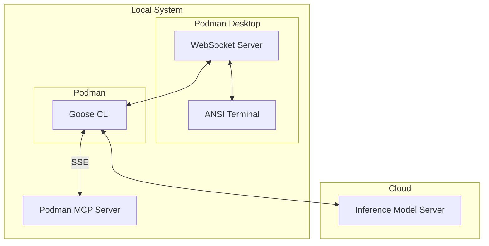

## Architecture

```mermaid
graph TD
    subgraph "Local System"
        subgraph "Podman Desktop"
            WebSocket["WebSocket Server"]
            Embedded_Terminal["ANSI Terminal"]
        end
        subgraph "Podman"
            Goose_CLI["Goose CLI"]
        end
        MCP_Server["Podman MCP Server"]
    end
    subgraph "Cloud"
        Inference_Model["Inference Model Server"]
    end
    WebSocket <--> Embedded_Terminal
    WebSocket <--> Goose_CLI
    Goose_CLI <-->|SSE| MCP_Server
    Goose_CLI <--> Inference_Model
```
