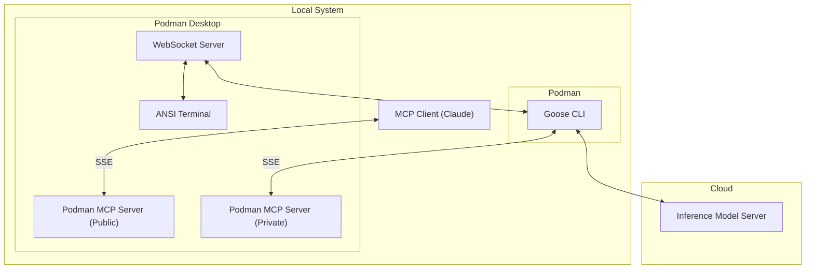

## Architecture

```mermaid
graph TD
    subgraph "Local System"
        subgraph "Podman Desktop"
            WebSocket["WebSocket Server"]
            Embedded_Terminal["ANSI Terminal"]
            MCP_Server_public["Podman MCP Server (Public)"]
            MCP_Server_private["Podman MCP Server (Private)"]
        end
        subgraph "Podman"
            Goose_CLI["Goose CLI"]
        end
        MCP_Client["MCP Client (Claude)"]
    end
    subgraph "Cloud"
        Inference_Model["Inference Model Server"]
    end
    WebSocket <--> Embedded_Terminal
    WebSocket <--> Goose_CLI
    Goose_CLI <--> |SSE| MCP_Server_private
    Goose_CLI <--> Inference_Model

    MCP_Client <--> |SSE| MCP_Server_public
```
