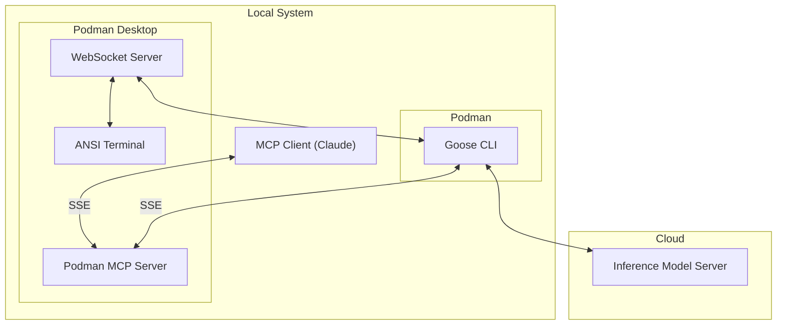

## Architecture

```mermaid
graph TD
    subgraph "Local System"

        MCP_Client["MCP Client (Claude)"]

        subgraph "Podman Desktop"
            WebSocket["WebSocket Server"]
            Embedded_Terminal["ANSI Terminal"]
            MCP_Server["Podman MCP Server"]
        end

        subgraph "Podman"
            Goose_CLI["Goose CLI"]
        end
    end

    subgraph "Cloud"
        Inference_Model["Inference Model Server"]
    end
    
    MCP_Client <--> |SSE| MCP_Server
    
    WebSocket <--> Embedded_Terminal
    WebSocket <--> Goose_CLI
    Goose_CLI <--> |SSE| MCP_Server
    Goose_CLI <--> Inference_Model

```
